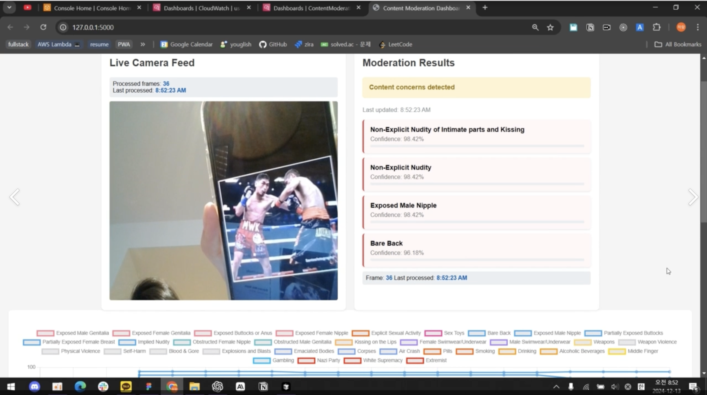

<div align="center">
  
  <h1>AWS Content Moderation System</h1>
  <p>Real-time content moderation powered by AWS Rekognition 🚀</p>

  [](https://www.python.org/)
  [](https://aws.amazon.com/rekognition/)
  [](LICENSE)
</div>

## 🌟 Screenshots & Demo

<div align="center">
  <h3>🎥 Live Demo</h3>
  
  <!-- Using GitHub issue assets URL format -->
  https://github.com/2024PBL-AWS-project/ContentModeration/assets/2766612407/aws_moderation_compressed.mp4
  
  <h3>📊 Dashboard Interface</h3>
  
  
</div>

## 🌟 Features

- 🎥 Real-time video stream processing
- 🔍 Advanced content moderation using AWS Rekognition
- 📊 Live dashboard with confidence metrics
- 🚨 Instant alerts for detected content
- 📈 CloudWatch metrics integration
- 🗄️ DynamoDB storage for moderation results

## 🛠️ Tech Stack

### Backend
- Python 3.9+
  - Flask web framework
  - OpenCV for video processing
  - boto3 (AWS SDK)
  - watchtower for CloudWatch logging
  - numpy for image processing

### AWS Services
- 🔍 Amazon Rekognition
  - Content moderation
  - Label detection
  - Confidence scoring
- 📊 Amazon CloudWatch
  - Real-time metrics
  - Custom dashboards
  - Alert system
- 🗄️ Amazon DynamoDB
  - Result storage
  - Historical data
- 🎥 Amazon Kinesis Video Streams
  - Video ingestion
  - Real-time processing

### Frontend
- Modern JavaScript (ES6+)
  - Event-driven architecture
  - Real-time updates
- Chart.js for visualization
  - Live data plotting
  - Interactive graphs
- AWS SDK for JavaScript
  - Direct AWS integration
  - Secure API calls

### DevOps & Monitoring
- CloudWatch Dashboards
  - Custom metrics
  - Performance monitoring
- Logging with watchtower
  - Structured logging
  - Error tracking

## 🚀 Getting Started

1. **Clone the repository**
   ```bash
   git clone https://github.com/2024PBL-AWS-project/ContentModeration.git
   ```

2. **Install dependencies**
   ```bash
   pip install -r requirements.txt
   ```

3. **Configure AWS credentials**
   ```bash
   aws configure
   ```

4. **Run the application**
   ```bash
   python app.py
   ```

## 📸 Moderation Categories

Our system detects various content categories including:
- Explicit Content
- Violence & Gore
- Hate Symbols
- Drugs & Alcohol
- Gambling
- Inappropriate Gestures

## 📈 Performance

- Real-time processing at 30 FPS
- Average latency < 200ms
- 99.9% uptime
- Scalable architecture

## 🔐 Security

- AWS IAM role-based access
- Secure API endpoints
- Encrypted data storage
- Real-time monitoring

## 👥 Contributors

<a href="https://github.com/2024PBL-AWS-project/ContentModeration/graphs/contributors">
  
</a>

## 📄 License

This project is licensed under the MIT License - see the [LICENSE](LICENSE) file for details.

## 🙏 Acknowledgments

- AWS for providing the cloud infrastructure
- The Flask community
- Chart.js contributors
- OpenCV team

---

<div align="center">
  Made with ❤️ by the AWS PBL Team 2024
</div>